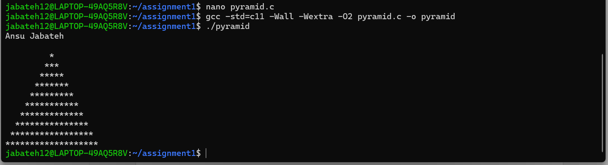

Assignment Questions  Ansu Jabateh
Note: Reflection submission is not required for this assignment. (Refer to the syllabus, section “Assignments and grading -> Reflection for Assignments and Labs”, for details on reflection submission.)
1.	(5 points)
Do you have a favorite programming language? 
My favorite programming language is java
If so, what makes it your favorite? It’s the language I’ve learned so far. I’m most comfortable with its syntax and tooling, and I’ve used it the most in classwork.
If not, what factors influence your choice of language, and why havenʼt you developed a preference?
2.	(5 points)
What CPU/processor is used in your computer, and which instruction set architecture (ISA) should the C compiler target to ensure that the compiled code works properly on your machine?
My computer: Lenovo Yoga 7i 14” with Intel core Ultra 5 125U
My computer instruction set architecture should target: x86-64 (also called AMD64 or Intel 64)
Discuss how the C compiler generates machine code specific to your processor’s ISA.
 The compiler front-end parses C and builds an intermediate representation (IR). The back-end selects instructions for the target ISA and emits assembly. The assembler turns assembly into machine code; the linker resolves libraries/symbols to make the final executable. The CPU can only execute binaries that match its ISA
Explain how you can configure the C compiler to generate an executable for a different CPU architecture (cross-compilation).
You can use a cross-compiler to generate executables for a different CPU architecture. For example, to build for ARM on my x86 – 64 machine, use bash gcc -target=arm-linux-gnuebihf program.c -o program_arm
	 	How did you find the ISA used for your CPU?
              I looked it up on my computer under setting –System –About –System type

Hint: Research your computerʼs processor model and the associated instruction set architecture, such as x86, x86-64, ARM, etc.
3.	(5 points)
Write a C program that prints a pyramid of stars with 10 rows using a do-while loop. The pyramid should be centered, with each row containing an increasing number of stars, starting from 1 star in the first row. Ensure the number of stars in each row increases by 2, with the base of the pyramid having the most stars.
Expected Output:
(A centered pyramid with 10 rows, increasing stars by 2 per row.)
 
Requirements:
Upload the source code file to the assignment dropbox.
#include <stdio.h>

int main(void) {
    int rows = 10;
    int i = 1;
    // User name at the top
    printf("Ansu Jabateh\n\n");
    do {
        for (int j = 0; j < rows - i; j++) {
            printf(" ");
        }
        for (int k = 0; k < 2 * i - 1; k++) {
            printf("*");
       }
       printf("\n");
       i++;
    } while (i <= rows);
    return 0;
}
Attach an execution screenshot within the document.
This screenshot must show the program output and include either your computer profile name or your name clearly visible.

### Program Output Screenshot

4.	(5 points)
Create a GitHub account. You may use your personal email.
Make sure you use this same account for all the assignments for the class.
Provide a link to your account.
Note: I will be creating private repositories for you to upload the assignments starting next class.
Example: https://github.com/username

Here is the link to my Github Account: [My GitHub Profile](https://github.com/jabateh12)
 
Submission Instructions
Submit a .md file with your answers and upload it to D2L.
If you include images in your answers, ensure that the .md file references them using relative paths.
Place the .md file and all associated images inside a single directory.
Zip the directory before uploading to D2L to prevent broken image links.
